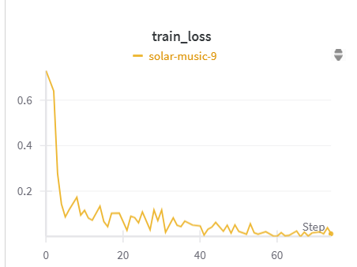
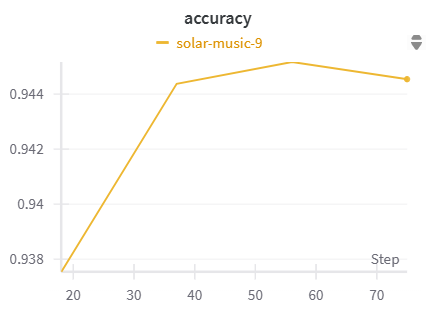
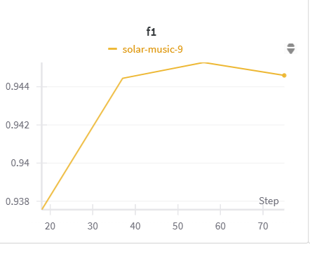

# BERT Fine-Tuning Project

## Setup Instructions
1. **Clone the repository**:
   ```bash
   git clone https://github.com/vinit5112/BERT-Finetune.git
   cd BERT-Finetune
   ```

2. **Create a virtual environment** (optional but recommended):
   ```bash
   python3 -m venv venv
   source venv/bin/activate  # On Windows, use `venv\Scripts\activate`
   ```

3. **Install the dependencies**:
   Install the required packages using `pip`:
   ```bash
   pip install -r requirements.txt
   ```

   Alternatively, manually install each package:
   ```bash
   pip install transformers datasets wandb seaborn matplotlib psutil tqdm
   ```
   ```bash
   pip3 install torch torchvision torchaudio --index-url https://download.pytorch.org/whl/cu124
   ```

## Training and Evaluation Completed

The model has already been trained and evaluated. The training script has been executed, and the results are available in the `outputs/` directory. The model and its weights have been saved in the `models/` directory.

## Dependencies

- **torch**: Deep learning framework for training BERT.
- **transformers**: Provides BERT pre-trained models and fine-tuning utilities.
- **datasets**: Library for handling datasets and loading data efficiently.
- **wandb**: For experiment tracking and visualization.

## Project Structure

```plaintext
.                
├── models/              
├── config.py            
├── bert-finetune.ipynb
├── bert-finetune-approach2.ipynb
├── requirements.txt     
└── README.md            
```

The `ipynb` script has already been executed to train the model, and the evaluate we have implimented with wandb.

### Training Results

- **Train_loss** : 0.012415256351232529
- **Accuracy** : 94.45416666666666%
- **F1** : 0.9445416666666666

<!--  -->




- **For more information**

[**Bert-Finetune-Result**](https://api.wandb.ai/links/tavdevinit44-thinkbiz-technology-pvt/1ozrgeyd)

[**Bert-Finetune-Result-Approach2**](https://api.wandb.ai/links/tavdevinit44-thinkbiz-technology-pvt/jt90rbyd)

### Comparision with distilbert-base-uncased Model

| Metric     | bert-base-uncased | distilbert-base-uncased |
|------------|-------------------|--------------------------|
| Train Loss | 0.0124            | 0.0180                   |
| Accuracy   | 94.45%            | 94.09%                   |
| F1 Score   | 0.9445            | 0.9410                   |


### For inference

Since the training and evaluation have already been completed, you can simply load the saved models from the `model/` directory and use them for inference or further tasks.

For example:
```python
from transformers import AutoModelForSequenceClassification, AutoTokenizer

model_path = '/kaggle/working/model' 

model = AutoModelForSequenceClassification.from_pretrained(model_path)
tokenizer = AutoTokenizer.from_pretrained(model_path)
print(model)
print(tokenizer)

text = "Wall St. Bears Claw Back Into the Black (Reuters) Reuters - Short-sellers, Wall Street's dwindling\band of ultra-cynics, are seeing green again."

inputs = tokenizer(text, return_tensors="pt", padding=True, truncation=True)
with torch.no_grad():
    outputs = model(**inputs)

logits = outputs.logits
predictions = torch.argmax(logits, dim=-1)

print(f"Predicted class: {predictions.item()}")
```
Output:
```
Predicted class: 2
```
